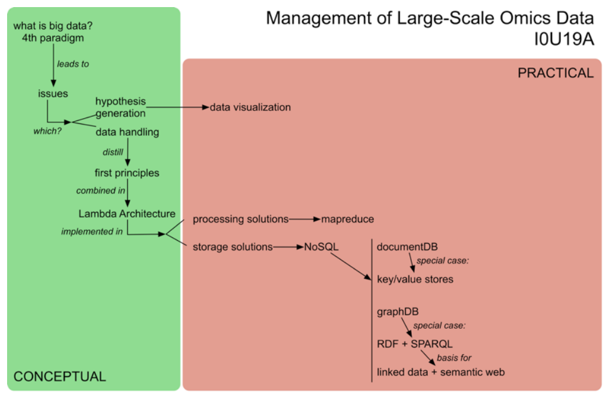
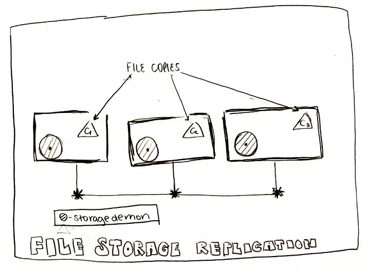
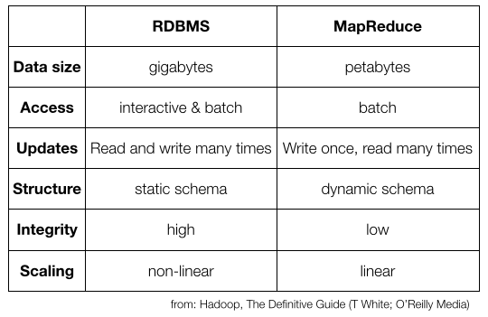

% Data Processing
% Toni Verbeiren & Jan Aerts
% 20/3/2014

# Introduction

- - -

## Contents

* Introduction
* Parallel Word Count
* Functional Programming
* Map Reduce
* Hadoop Implementation
* Distributed File System
* Alternatives to Hadoop
* Streaming Data
* Hadoop Ecosystem
* Links


- - -

## What this session is about

Processing data, *big* data

- - -



- - -


## HPC versus HTC

- High Performance Computing: 
    - Focus on computation
    - _small_ data
    - Parallelism is hard
    - Examples: matrix transformations, large scale simulations, ...
- High Throughput Computing: 
    - Focus on volume, throughput
    - _big_ data
    - Parallelism is often obvious
    - Examples: finding patterns (genes) in genome, filtering data, ...


- - -


## How this fits in the whole

- - -


- - -


# Parallel Word Count

- - -

## What to count?

Take [Ulysses](http://www.gutenberg.org/ebooks/4300) (James Joyce)

- How many occurrences of every word are there?
- Top-10?

- - -


> ULYSSES
> 
> by James Joyce
> 
> -- I --
> 
> Stately, plump Buck Mulligan came from the stairhead, bearing a bowl of
> lather on which a mirror and a razor lay crossed. A yellow dressinggown,
> ungirdled, was sustained gently behind him on the mild morning air. He
> held the bowl aloft and intoned:
> 
> --_Introibo ad altare Dei_.
> 
> Halted, he peered down the dark winding stairs and called out coarsely:
> 
> ...

\ 

<http://www.gutenberg.org/ebooks/4300>

- - -


## Traditional approach

```python
#!/usr/bin/python

import sys

wordcount={}

for line in sys.stdin:
  line = line.strip()
  for word in line.split():
    if word not in wordcount:
        wordcount[word] = 1
    else:
        wordcount[word] += 1
for k,v in wordcount.items():
  print k, v
```

\ 

Keep a log of the counts !

- - -

The top-10 of the words in the text:

```bash
> cat Joyce-Ulysses.txt | wordcount.py | sort -r -g -k2,2 | head
```

\ 

The result:

```bash
the 13600
of 8127
and 6542
a 5842
to 4787
in 4606
his 3035
he 2712
I 2432
with 2391
```

\ 

We do not consider special characters, sentence endings, capitals, etc.

\ 

What about all works of Shakespeare? Or all books in the library?

- - -

## Parallel version?

- - -

Split up the problems in chunks!

- Words to look for?
- Chunks of text?


```python

wordcount={}

runWordCountOnChunk1()
runWordCountOnChunk2()
runWordCountOnChunk3()
```


- - -

<div class="sticky">
A mutable data structure is hard to work with in a distributed fashion!
</div>

\ 

Remember mutable databases?


# Functional Programming

- - -

## What went wrong in the first version?

- Big loop
- Mutable data structure for intermediate results

- - -

Underlying issue:

\ 

### _What_ to do is intermixed with _how_ to do it


- - -

## Functional approach

Ideas: 

- Stick to _what_ to compute
- Functions take input and produce output without side-effects
- No mutable data structures
- AND: higher-order functions

- - -

## Examples

A typical implementation of _exponential_ in Python:

```python
def loopExp(x,n):
    tmp = 1
    for i in range(0,n):
        tmp = tmp * x
    return tmp
```

- - -

A Functional alternative:

```python
def exp(x, n):
    if n == 0:
        return 1
    else:
        return x * exp(x, n-1)
```

- - -

## Higher-order functions

Define the following square function:

```python
def exp2(x):
    return exp(x,2)
```

\ 

We can then apply this function to all elements in a list:

```python
>>> map(exp2,[1,2,3,4])
[1, 4, 9, 16]
```

- - -

Define the following sum function:

```python
def sum(x,y):
   return x + y
```

\ 

We can now calculate the sum of all elements in a list:

```python
>>> reduce(sum,[1,2,3,4])
10
```

- - -

This is where the fun starts:

```python
>>> reduce(sum,map(exp2,[1,2,3,4]))
30
```

- - -

One more important function:
```python
>>> filter(lambda x: x>2 ,[1,2,3,4])
[3, 4]
```

\ 

Here, we introduced Lambda expression in Python. The above is the same as:

```python
def filter2(x):
    return x>2
filter(filter2 ,[1,2,3,4])
```

- - -

## What's all the buzz about?

We only described _what_ to do, not _how_!

The compiler can fill in the blanks!


# MapReduce

- - -

## Google to the rescue...

Engineers at Google came up with the idea (2003!).

Open Source developers copied the ideas and implemented Hadoop.


- - -

## Idea

Chain `map` and `reduce` calls.

\ 

That's it!

- - -

## No, it is not...

But it could be...

\ 

Situation: 

> A lot of mainstream programming languages do not support Functional
> Programming in a standard way.

\ 

Think of Java, C, C++, ...

- - -

## Workaround

The workaround:

> Make very strict assumptions on what is passed back and forth 
> between `map` and `reduce`.

\ 

Key-Value pairs to the rescue !

\ 

But: make sure fault-tolerance is built in...


# MapReduce in real-life

- - -

## Mapper 

Each of you gets some lines from Ulysses.

\ 

Script:

    Add a 1 for every occurrence of 'the'
    Add a 1 for every occurrence of 'a'

- - -

## Reducer

Script:

    Sum the total for 'the'
    Sum the total for 'a'


# Hadoop implementation

- - -

## Java example

```java
package org.myorg;
        
import java.io.IOException;
import java.util.*;
        
import org.apache.hadoop.fs.Path;
import org.apache.hadoop.conf.*;
import org.apache.hadoop.io.*;
import org.apache.hadoop.mapreduce.*;
import org.apache.hadoop.mapreduce.lib.input.FileInputFormat;
import org.apache.hadoop.mapreduce.lib.input.TextInputFormat;
import org.apache.hadoop.mapreduce.lib.output.FileOutputFormat;
import org.apache.hadoop.mapreduce.lib.output.TextOutputFormat;
        
public class WordCount {
        
 public static class Map extends Mapper<LongWritable, Text, Text, IntWritable> {
    private final static IntWritable one = new IntWritable(1);
    private Text word = new Text();
        
    public void map(LongWritable key, Text value, Context context) throws IOException, InterruptedException {
        String line = value.toString();
        StringTokenizer tokenizer = new StringTokenizer(line);
        while (tokenizer.hasMoreTokens()) {
            word.set(tokenizer.nextToken());
            context.write(word, one);
        }
    }
 } 
```

- - -

```java        
 public static class Reduce extends Reducer<Text, IntWritable, Text, IntWritable> {

    public void reduce(Text key, Iterable<IntWritable> values, Context context) 
      throws IOException, InterruptedException {
        int sum = 0;
        for (IntWritable val : values) {
            sum += val.get();
        }
        context.write(key, new IntWritable(sum));
    }
 }
```

- - -

```java
 public static void main(String[] args) throws Exception {
    Configuration conf = new Configuration();
        
    Job job = new Job(conf, "wordcount");
    
    job.setOutputKeyClass(Text.class);
    job.setOutputValueClass(IntWritable.class);
        
    job.setMapperClass(Map.class);
    job.setReducerClass(Reduce.class);
        
    job.setInputFormatClass(TextInputFormat.class);
    job.setOutputFormatClass(TextOutputFormat.class);
        
    FileInputFormat.addInputPath(job, new Path(args[0]));
    FileOutputFormat.setOutputPath(job, new Path(args[1]));
        
    job.waitForCompletion(true);
 }
        
}
```


# Example with Hadoop Streaming

- - -

## Easy input file

```shell
> cat easy_file.txt
a b c a b a
```

Initial word count script:

```shell
> cat easy_file.txt | ./wordcount.py
a 3
c 1
b 2
```

- - -

## Mapper

```python
#!/usr/bin/env python

import sys

for line in sys.stdin:
    line = line.strip()
    words = line.split()
    for word in words:
        print '%s\t%s' % (word, 1)
```

```shell
> cat easy_file.txt | ./mapper.py
a   1
b   1
c   1
a   1
b   1
a   1
```

- - -

## Reducer


```python
#!/usr/bin/env python

from operator import itemgetter
import sys

current_word = None
current_count = 0
word = None

for line in sys.stdin:
    line = line.strip()
    word, count = line.split('\t', 1)

    count = int(count)

    if current_word == word:
        current_count += count
    else:
        print '%s\t%s' % (current_word, current_count)
        current_count = count
        current_word = word

# do not forget to output the last word if needed!
if current_word == word:
    print '%s\t%s' % (current_word, current_count)
```


- - -


```bash
> cat easy_file.txt | ./mapper.py | ./reducer.py
a   1
b   1
c   1
a   1
b   1
a   1
```

What happened?

- - -

```python
#!/usr/bin/env python

from operator import itemgetter
import sys

. . .

for line in sys.stdin:
    . . .

    # this IF-switch only works because Hadoop sorts map output
    # by key (here: word) before it is passed to the reducer
    if current_word == word:
        current_count += count
    else:
        if current_word:
            # write result to STDOUT
            print '%s\t%s' % (current_word, current_count)
        current_count = count
        current_word = word

. . .
```

- - -

Sorting added:

```bash
> cat easy_file.txt | ./mapper.py | sort -k 1,1 | ./reducer.py
a   3
b   2
c   1
```

This is bascially what Hadoop does!

\ 

Please note: _value_ can be scalar, list, data structure, ...


- - -

## MapReduce with Hadoop

- - -


- - -

## Using Hadoop streaming

On a Mac:

```bash
> hadoop jar /usr/local/Cellar/hadoop/1.2.1/libexec/contrib/streaming/hadoop-streaming-1.2.1.jar \
  -file mapper.py -mapper mapper.py \
  -file reducer.py -reducer reducer.py \
  -input Joyce-Ulysses.txt \
  -output output
```

The result is a **folder**:

```bash
> ls output
_SUCCESS   part-00000
```

- - -

Via Hadoop on teaching server:

```bash
> hadoop jar /usr/lib/hadoop/contrib/streaming/hadoop-streaming-0.20.2-cdh3u6.jar \
  -file mapper.py -mapper mapper.py \
  -file reducer.py -reducer reducer.py \
  -input Joyce-Ulysses.txt \
  -output wc
```

\ 

The result is the same.


# Distributing the File System

- - -

## Questions

Some questions:

1. What about GBs or TBs or ... of data?
2. What about distributing that using MR?

- - -

## Distributed FS

Concept:

- Split file in blocks of 64MB
- Distribute blocks accross cluster
- Keep 3 copies for redundancy
- **Computation goes to the data**

- - -

## A picture ...




- - -

## Consequences of distribution and immutability

Remember?

```bash
> ls output
_SUCCESS   part-00000
```

\ 

* Output: 1 file / reducer.
* Input: Folder, but can be file as well

\ 

Combining:

```
hadoop fs –getmerge output/ WordCount.txt
```

- - -


## DFS and MR: Better Together

Traditional processing: Bring data to computation

Big Data: Bring computation to data


# Alternatives to Hadoop

- - -

## Google

Links:

- <http://research.google.com/archive/mapreduce.html>
- <http://research.google.com/archive/gfs.html>

- - -

## Spark

Also [Apache product]

Based on functional language (Scala).

\ 

Example word count in Scala:

```scala
val file = spark.textFile("hdfs://...")
val counts = file.flatMap(line => line.split(" "))
                 .map(word => (word, 1))
                 .reduceByKey(_ + _)
counts.saveAsTextFile("hdfs://...")
```

- - - 

[Python interface] : `pyspark`

\ 

Word count in Python:

```python
file = sc.textFile("Joyce-Ulysses.txt")
counts = file.flatMap(lambda line: line.split(" ")) \
             .map(lambda word: (word, 1)) \
             .reduceByKey(lambda a, b: a + b)
counts.collect()
```

In order to write the output to a file, replace the last line by:

```python
counts.saveAsTextFile("output_file.txt")
```


[Apache product]: http://spark.incubator.apache.org/examples.html
[Python interface]: <http://spark.apache.org/docs/0.9.0/python-programming-guide.html>


# Streaming data

- - - 


- - - 

Requires different algorithms and processing

Solutions exist: 

* Kafka: manage the queue
* Storm: process the queue

Spark can do it too!


# Hadoop ecosystem

- - -

See also: <http://hadoopecosystemtable.github.io/>

- - -

## Cluster OS

Manage resources across the cluster:

* Yarn
* Mesos

- - -


## Some notable projects/tools

- - -

### Alternative Languages

Want to use MR, but without *heavy* Java?

* Pig: new _language_ (Telenet, Netflix, ...)
* Scalding: implemented in Scala (Twitter, ...)
* Cascalog: implemented in Clojure
* Etc.

- - -

Example of Pig word count:

```
a = load '. . .';
b = foreach a generate flatten(TOKENIZE((chararray)$0)) as word;
c = group b by word;
d = foreach c generate COUNT(b), group;
store d into '. . .';
```

- - -

Example of Scalding word count:

```
package com.twitter.scalding.examples

import com.twitter.scalding._

class WordCountJob(args : Args) extends Job(args) {
  TextLine( args("input") )
    .flatMap('line -> 'word) { line : String => tokenize(line) }
    .groupBy('word) { _.size }
    .write( Tsv( args("output") ) )

  // Split a piece of text into individual words.
  def tokenize(text : String) : Array[String] = {
    // Lowercase each word and remove punctuation.
    text.toLowerCase.replaceAll("[^a-zA-Z0-9\\s]", "").split("\\s+")
  }
}
```

- - -

### Databases on top of Hadoop

*  HBase: 
    *  key/value store on top of Hadoop
    *  Based on [Google BigTable]
*  Parquet:
    - Columnar storage 
    - Based on ideas from [Google Dremel]
* Drill:
    - Columnar storage
    - Based on Dremel

[Google BigTable]: http://research.google.com/archive/bigtable.html
[Google Dremel]: http://research.google.com/pubs/pub36632.html

- - -

### SQL support

MR, Spark, Pig, ... not familiar to traditional RDBM experts.

*  Hive: 
    *  SQL on Hadoop, 
    *  On top of: HDFS, HBase, Parquet, ...
*  Shark: 
    *  SQL on top of Spark


# Roundup

- - -



- - -

## Links

Some links:

- <http://architects.dzone.com/articles/how-hadoop-mapreduce-works>
- <https://files.ifi.uzh.ch/dbtg/sdbs13/T10.0.pdf>
- <http://research.google.com/archive/mapreduce-osdi04.pdf>
