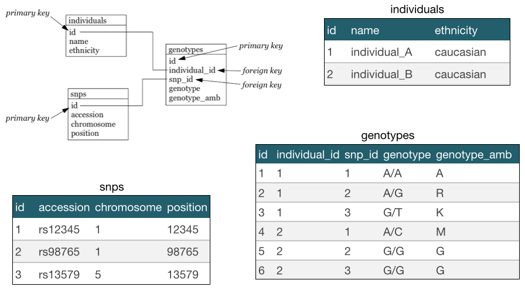
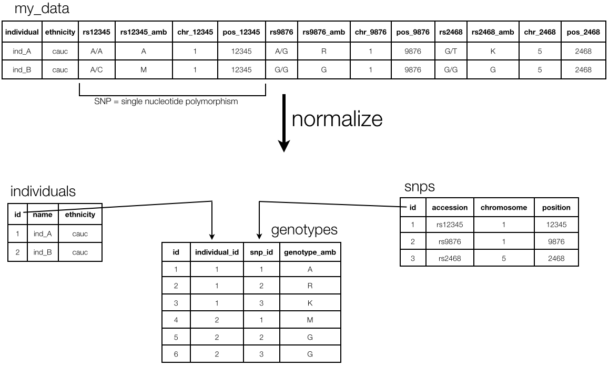
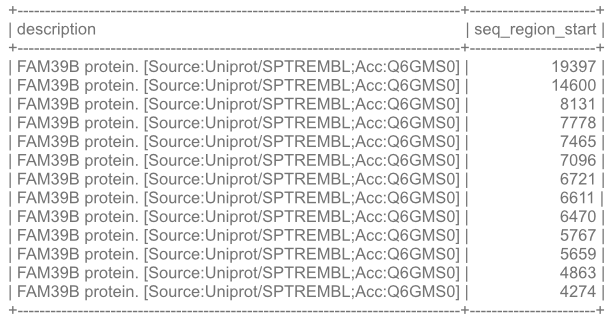
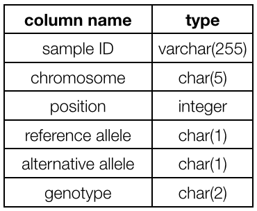

# I0U19A  -  Management of large-scale omics data

---

Prof Jan Aerts - Faculty of Engineering ESAT/STADIUS

jan.aerts@esat.kuleuven.be - http://visualanalyticsleuven.be

Teaching assistants:

* Toni Verbeiren (toni.verbeiren@esat.kuleuven.be)
* Ryo Sakai (ryo.sakai@esat.kuleuven.be)
* Raf Winand (raf.winand@esat.kuleuven.be)

----

# Course overview

---

## Schedule

| Week | Date | Room | Type | Topic |
|------|------|------|------|-------|
| 1 | 13/2/2014 | LAND 91.30 | lecture | What is big data? |
| 2 | 20/2/2014 | LAND 91.30 | lecture | Visual Analytics |
| 3 | 27/2/2014 | LAND 91.30 | exercise | Visual Analytics |
| 4 | 6/3/2014 | no lecture	 | (SQL exercise)  |  |
| 5 | 13/3/2014 | LAND 91.30 | lecture | Lambda Architecture |
| 6 | 20/3/2014 | LAND 91.30 | lecture | Data processing |
| 7 | 27/3/2014 | LAND 91.30 | exercise | Data processing |
| 8 | 3/4/2014 | no lecture |  |  |
| 9 | 24/4/2014 | LAND 00.210 | lecture | Document and graph databases |
| 10 | 8/5/2014 | LAND 00.210 | exercise | Document databases |
| 11 | 15/5/2015 | LAND 00.210 | exercise | Graph databases |
| 12 | 22/5/2014 | LAND 00.210 | exam | |

---

## Exercises

Three datasets:

* genotypes
* beers in Belgium
* approved drugs

 
Modeled and stored using different database technologies => which technology (or combination of technologies) fits a particular dataset (and its intended use) best?

Preparation of exercise session: assignment including e.g. modelling of data => answers will be used in exercise session

---

## Evaluation

Combination of:

* permanent evaluation (including preparation of exercise sessions): 10%
* take-home data visualization assignment: 10%
* open-book written exam: 80%

 
At least 8/20 for each.

---

## Interesting books

* Marz N & Warren J (2013). Big Data. Manning Publications.
* McCreary D & Kelly A (2013). Making Sense of NoSQL. Manning Publications.
* Wood D, Zaidman M & Ruth L (2013). Linked Data. Manning Publications.

---

## Your background

* scripting?
* SQL?

---

## Today - What is big data?

----

# What is big data?

How would *you* describe "big data"? Can you give examples?

---

## Some examples

* **Netflix** - analysis of traffic patterns across device types to improve reliability of video streaming; recommendation engine based on viewing habits
* **Politics: project "Narwhal"** - Obama campaign operations: don't knock on door of people who have already volunteered, don't send email asking for money to people who already contributed
* **WeatherSignal** - repurposes sensors in Android smartphones to map atmospheric readings (barometer, hygrometer, ambient thermometer, light meter)
* **Retail (Target)** - predict future purchasing habits (e.g. pregnancy) => targeted ads

---

## Why are these examples different?

* Data collection is easy
* Data is often unstructured
* Data can be used for many things

 
Example datasets available at http://www.datasciencecentral.com/profiles/blogs/big-data-sets-available-for-free

---

## Big data - the bigger picture

"Fourth Paradigm" of scientific research (Jim Grey, Microsoft)

|     |                  |                  |                                      |
|:----|:-----------------|:-----------------|:-------------------------------------|
| 1st | 1,000s years ago | empirical        | describing natural phenomena         |
| 2nd | 100s years ago   | theoretical      | theoretical "laws" (Kepler, Newton) |
| 3rd | last few decades | computational    | modeling, simulation                 |
| 4rd | today            | data exploration | data processing                      |

---

## Some terms you might encounter

* OLTP = On Line Transaction Processing (*batch layer*)
* OLAP = On Line Analytic Processing (*serving layer*)

	OLTP	OLAP
application	operational	analysis
refresh	immediate	periodic
data model	entity-relationship	multi-dimensional
schema	normalized	star
emphasis	update	retrieval

---

## Factors in (big) data

* **Data collection** - is the easy part. Every individual is not only a data collector but also generator (clicks, comments on Facebook, ...)
 * Some restrictions might apply, e.g. more difficult to get patient data, potentially identifiable information, ...
* **Ingesting and cleaning** (a.k.a. ETL: Extract-Transform-Load) - putting the right data in the right column in the right format
 * big data: often unstructured data => how does this fit in a relational database?
 * = 80% of effort in data collection
 * OpenRefine - www.openrefine.org

* **Hardware** - With big data: still need storage, processing and network. But it changes how these are used (e.g. virtualization, cloud computing)
* **Platforms** - When big data need to be processed we will often try to speed this up using parallelization. Still: not fast enough if (1) we’re working in an interactive user interface, or (2) we want to analyze unstructured data iteratively
* **Human exploration** - While machine learning is an important tool in data analysis, there’s no substitute for human eyes => with big data: stretching the limits of multi-dimensional visualization
* **Storage** - raw data + transformed data + virtual machines to analyze the data + analysis results + legacy formats; mix: cloud + on-premise storage

----

# Defining "big data"?

* big data = data that exceeds processing capacity of conventional database systems (too big, moves too fast, doesn’t fit in database structure)
* Being able to process every item of data in reasonable time removes the troublesome need for sampling
* Necessary counterpart: agility - successful exploitation of big data requires experimentation and exploration
* Because it’s big: bring computation to the data instead of the data to the computation

 
*Different way of thinking*

---

## The Three V's

### 1. Volume

* most immediate challenge to conventional IT structures; principle of big data: *if you can, keep everything*
* need scalable storage + distributed querying
* structured vs unstructured data -> Hadoop: MapReduce + HDFS
 * MapReduce: map = distributing a dataset among multiple servers and operating on the data; reduce = recombining the partial results
 * HDFS = Hadoop Distributed File System
 * Hadoop: for batch jobs (not interactive)

---

### 2. Variety

*Data is messy*

* 80% of effort in dealing with data = cleaning up
* process of moving from source data to processed application data involves loss of information
* relational databases: not always best destination for the data, even when tidied up (network data -> graph database; XML data -> dedicated XML store; ...)
* disadvantage of relational database: fixed schema <=> results of computations will evolve with detection and extraction of more signals
=> semi-structured NoSQL databases provide this flexibility: provide enough structure to organize data but do not require the exact schema of the data before storing it

---

### 3. Velocity

* increasing rate at which data flows into an organization, but also of system’s output
* origins: (1) velocity of incoming data; (2) speed of taking data from input through to decision
* often not possible to simple wait for a report to run or Hadoop job to complete
* streaming: important to consider, because (1) if input data too fast to store in its entirety (e.g. Large Hedron Collider @ CERN); (2) application might mandate immediate response to the data
* => need for speed (--> has driven development of key-value stores and columnar databases)

----

# Big datasets and relational databases

---

## Normal forms

---

## 1. Querying scalability

Database schema normalization: every piece of information is stored only once 
 => makes updating data easier and safer
 => requires less space (!)

---

---

* advantage of normalized database: you can **ask any question**
* disadvantage of normalized database: to get an answer you will have to **join tables** => is expensive (i.e. becomes very (!) slow) if you have to combine many large tables (millions of rows)

* "Return all names of individuals that have heterozygous SNPs on chromosome 1"
<pre><code>SELECT DISTINCT i.name
FROM individuals i, snps s, genotypes g
WHERE i.id = g.individual_id            // join!
AND s.id = g.snp_id                     // join!
AND s.chromosome = 1
AND g.genotype_amb NOT IN ("A","C","G","T");</code></pre>

---

Solution: **de-normalize**

 
Getting exon positions from **Ensembl** (= normalized database; 74 tables)

---

<pre><code>SELECT g.description, e.seq_region_start
FROM gene g, transcript t, exon_transcript et, exon e
WHERE g.gene_id = t.gene_id
AND t.transcript_id = et.transcript_id
AND et.exon_id = e.exon_id
AND g.description LIKE "FAM39B protein%";</code></pre>

---

Getting exon positions from **UCSC** (= de-normalized database; 10,014 tables!!)

---

<pre><code>SELECT exonStarts
FROM geneid
WHERE name = "chr1_1.1";</code></pre>

---

### Star schema

* Enables fast querying of data by minimizing joins (necessary in normalized schema)
* 2 attributes: (1) always 2 levels deep; (2) contains only one large table that is the focus of the model (**fact table**) plus >1 **dimension tables**
* database using star schema = reporting database (OLAP; != the authoritative source of the data)
=> temporarily forget the rules of normalization
* signals that you deviate from true star schema: (1) desire to retain the relationships between dimensions (= “snowflaking”); (2) existence of more than one fact table

---

---

### Going from normalized to star schema

* Everything revolves around sales => base the fact table on the sale table (one row in fact table = one row in sale table)
* Flattened the relationships all the way up the relational foreign key chain => keys in all reference tables become foreign keys in the fact table
Create dimensions for the data pointed to by each of the foreign keys.

---

Exercise: Draw a database design to optimize analysis of the data stored in a database that looks like this:

---

## 2. Writing scalability

Suppose you’re writing a tool to store genomic variants as they are identified in a large number of .bam files into a relational database
=> "Timeout error on inserting to database"

---

Solution 1: **queuing**

 
wasteful to only do a single insert at a time => batch many inserts in a single request => no timeouts anymore (but queue will get longer)
 
=> with ever bigger loads: again bottleneck DB

---

Solution 2: **sharding**

 
use multiple database servers, each with a subset of the data (= "horizontal partitioning" or "sharding"), e.g. 1 server per chromosome

 
but:

* all your application code needs to know how to find the shard for each key
* when databases to big again: split shards (e.g. p- vs q-arm; per Mb; ...)
* if so: need to update all application code that interacts with DB

---

general challenges concerning storage and writing:

* **fault-tolerance is hard**: as number of machines increases -> higher chance that one of them goes down
* **complexity is pushed to application layer**: distributed nature of your data is not abstracted away from you (sharding)
* **lack of human fault-tolerance**: system must be carefully thought out to limit the damage a human mistake can cause
* **maintenance** is an enormous amount of work (re-sharding!)

----

# Big data techniques

* computational systems should be **self-aware of their distributed nature** => sharding, replication, ... are handled for you
* **data is immutable** => when you make a mistake you might write bad data but at least you didn’t destroy good data => human fault-tolerant

---

